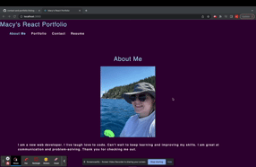

# react-portfolio

## Purpose
AS AN employer looking for candidates with experience building single-page applications
I WANT to view a potential employee's deployed React portfolio of work samples
SO THAT I can assess whether they're a good candidate for an open position

## Table of Contents
- [Purpose](#purpose) 
- [Demo Preview](#demo-preview)
- [Github Repository](#github-repository)
- [Deployed](#deployed)

## Demo Preview

## Github Repository
https://github.com/macykcool/react-portfolio

## Deployed
https://macykcool.github.io/react-portfolio/

## Made with ❤️️ by Macy Mannix
Mentored by UC Davis Full Stack Web Developer Bootcamp
